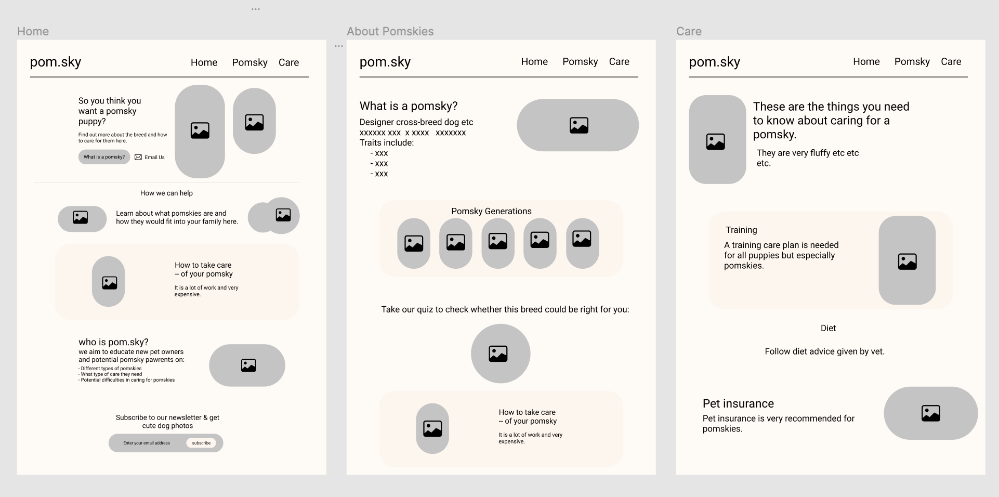
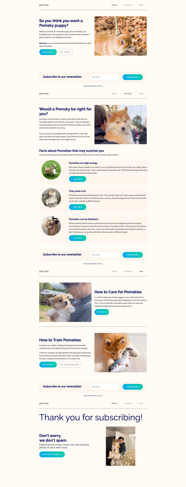

# 🦊 Project Overview
 This read-me documents my responsive website for the Futureproof 2022 Gebru Cohort. 

 I designed this website about Pomskies, a cross-breed dog that has become popular in the hopes of helping others understand more about these wonderful pets. ✨

 It was an opportunity to show everyone photos of my Pomsky puppy, Mimi. I like to thank that I embraced every chance to do so in this project.

 ## 📔 Contents
 - [⌚ Project Brief](#-project-brief)
 - [💡 Design  and development](#-design-and-development)
 - [📚 What I learnt](#-what-i-learnt)
 - [🚙 Reflections](#-reflections)

 ---

## ⏰ Project Brief

0:05 - 0:10 // Get a random subject courtesy of WikiRoulette

0:10 - 0:20 // Read Wiki and do additional research for content

0:20 - 0:45 // Design. No code. Use any tools you wish - pen & paper, Figma, wireframe.cc, MS Paint...!

0:45 - 0:50 // Stand & Stretch

0:50 - 1:50 // Code! We are not aiming for perfection. (We were told to aim for perfection)

1:50 - 2:00 // Deploy to production and prepare presentation

## 💡 Design and Development

**🖌 Sketch Layout**

Early wire-frame sketch ideas, including some features and functionality. Emphasis on UI/UX design.

**🎨 Figma**

I designed a wireframe in Figma which can be found [here](https://www.figma.com/file/v39g8BoMKcmQ2fb5jAy84d/Pomsky?node-id=0%3A1)
- This was my first wireframe for a project, and I added a lot of features
- Designed for desktop, but intended to also be responsive for mobile
- More developed design compared to the initial sketch
- Multiple pages designed to cover important topics such as the characteristics of Pomskies and what is involved in their care

**🎉 Deployed Site**

The final deployed site includes:

- Responsive nav bar that becomes a hamburger for mobile
- Responsive ideo images that add excitement and cuteness to the page
- Gradient buttons with a hover effect
- Fleshed-out sections using Bootstrap cards to emphasise Pomsky challenges
- Prototype page to discuss more about the design choices made during the project and challenges

## 💭 What I Learnt

- Planning the layout and functions of a site
- Making wireframe using Figma
- Organising and structuring code
- Commenting code for readability
- BootStrap 4.6
- Responsive video overlays
- Clone, push, merge and fetch from GitHub using Terminal commands
- Deploying on Netlify
- Pomskies are very cute

## ⌛️ Reflections
- Should have kept time limit more in mind when designing prototype and features
- Test more often on mobile during coding process

